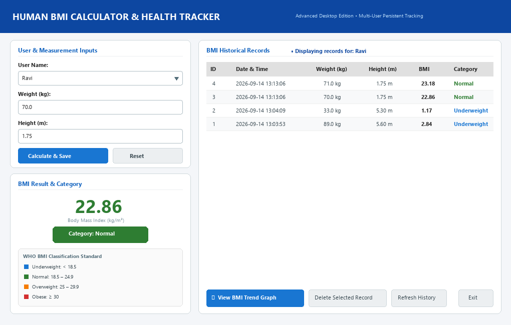
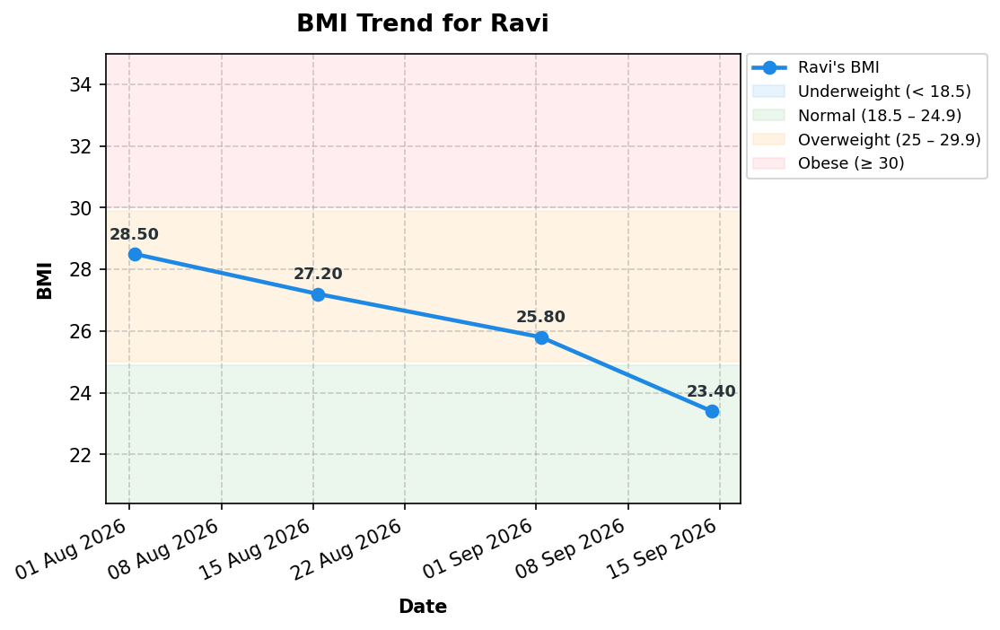

# Advanced Human BMI Calculator & Health Tracker (OIBSIP Task 2)

A modular, desktop Graphical User Interface (GUI) application developed in Python for the **Oasis Infobyte (OIBSIP) Python Programming Internship – Task 2: Human BMI Calculator (Advanced Level)**.

---

## 1. Project Title
**Advanced Human BMI Calculator & Health Tracker**  
*OIBSIP Python Programming Internship — Task 2 (Advanced Edition)*

---

## 2. Project Overview
The **Advanced Human BMI Calculator** is an independently engineered desktop application built with Python, Tkinter, SQLite3, and Matplotlib. It enables individuals and healthcare practitioners to calculate Body Mass Index (BMI), track historical measurements across multiple isolated user profiles, and visualize longitudinal health trends over time against World Health Organization (WHO) benchmarks.

### Application Screenshots

#### Desktop GUI Interface


#### Matplotlib BMI Trend Line Chart


---

## 3. Objective
To construct an intuitive, robust, and accessible desktop software system that:
- Seamlessly accepts weight in kilograms (kg) and height in meters (m).
- Accurately computes BMI using standard physiological arithmetic.
- Categorizes BMI according to exact clinical thresholds.
- Enforces strict input validation to prevent invalid entries and application crashes.
- Persistently manages multi-user historical records using a relational SQLite database.
- Plots chronological BMI progress trends via Matplotlib.
- Operates entirely via a desktop GUI without requiring terminal interaction.

---

## 4. Beginner Requirements Fulfilled
All fundamental beginner requirements are implemented:
- **Weight Input**: GUI field accepting positive decimal numbers in kilograms (e.g., `60`, `72.5`, `85.2`).
- **Height Input**: GUI field accepting positive decimal numbers in meters (e.g., `1.65`, `1.70`, `1.82`).
- **BMI Calculation**: Strict adherence to the standard formula:
  $$\text{BMI} = \frac{\text{weight}}{\text{height}^2}$$
- **BMI Classification**: Exact category boundaries:
  - **Underweight**: $\text{BMI} < 18.5$
  - **Normal**: $18.5 \le \text{BMI} \le 24.9$
  - **Overweight**: $25.0 \le \text{BMI} \le 29.9$
  - **Obese**: $\text{BMI} \ge 30.0$
- **Result Display**: Outputs BMI value rounded to exactly two decimal places along with the category designation.
- **Input Validation**: Rejection of empty strings, alphabetic characters, symbols, zero, and negative values with clear explanatory dialogs.

---

## 5. Advanced Features
- **Modern Desktop GUI**: Built using Tkinter and `ttk` with styled cards, clear typography, and responsive pane distribution.
- **Accessible Color-Coded Feedback**: Results feature high-contrast color badges accompanied by explicit descriptive text (ensuring accessibility for color-blind users).
- **Multi-User Profile System**: Complete data isolation across named profiles (e.g., "Ravi", "Amit") without cross-contamination.
- **Relational SQLite Persistence**: ACID-compliant storage with normalized tables (`users` and `bmi_records`), foreign keys, and indexes.
- **Interactive Historical Record Table**: Integrated `ttk.Treeview` with striped records, category tags, timestamping, and single-click record deletion.
- **Matplotlib Trend Visualization**: Interactive line graph displaying chronological BMI trajectory with WHO threshold reference bands, custom date formatters, and a navigation toolbar (zoom, pan, export to PNG).
- **Resilient Error Handling**: Custom exception hierarchy (`ValidationError`, `DatabaseError`, `InsufficientDataError`) preventing application crashes.

---

## 6. Technologies Used
- **Language**: Python 3.10+
- **GUI Framework**: Tkinter & `tkinter.ttk` (Standard Library)
- **Database**: SQLite3 (Standard Library)
- **Data Visualization**: Matplotlib (`matplotlib.backends.backend_tkagg`)
- **Unit & Integration Testing**: `unittest` (Standard Library)

---

## 7. Project Structure
```
Python Task2 BMICalculator/
│
├── database/
│   └── bmi_records.db             # Auto-created SQLite database file
│
├── screenshots/
│   └── bmi_trend_chart.png        # Sample trend plot export
│
├── src/
│   ├── __init__.py                # Package declaration
│   ├── bmi_calculator.py          # Business logic: arithmetic, validation, classification
│   ├── database.py                # Database access layer & SQLite connection manager
│   ├── chart.py                   # Matplotlib trend plotter & WHO range bands
│   ├── gui.py                     # Tkinter desktop layout, styles, and event handlers
│   └── main.py                    # Application bootstrap & top-level exception boundary
│
├── tests/
│   ├── __init__.py                # Test package declaration
│   ├── test_bmi_calculator.py     # Unit tests for calculation, validation, boundaries
│   ├── test_database.py           # Unit tests for SQLite CRUD & multi-user isolation
│   ├── test_chart.py              # Unit tests for chart generation & data thresholds
│   └── test_gui.py                # Automated integration tests for Tkinter UI components
│
├── .gitignore                     # Git exclusion rules
├── requirements.txt               # Minimal pip dependencies
└── README.md                      # Comprehensive project documentation
```

---

## 8. BMI Formula
The application computes Body Mass Index strictly according to the international standard:

$$\text{BMI} = \frac{\text{Weight (kg)}}{[\text{Height (m)}]^2}$$

### Calculation Example:
$$\text{Weight} = 70.00\text{ kg}, \quad \text{Height} = 1.75\text{ m}$$
$$\text{BMI} = \frac{70}{(1.75)^2} = \frac{70}{3.0625} \approx 22.85714\ldots \rightarrow \mathbf{22.86}$$

---

## 9. BMI Category Definitions
The software maps calculated BMI figures to the following clinical categories:

| Category | BMI Range ($\text{kg/m}^2$) | Visual Tone | Hex Code |
| :--- | :--- | :--- | :--- |
| **Underweight** | $\text{BMI} < 18.5$ | Informative Blue | `#1976D2` |
| **Normal** | $18.5 \le \text{BMI} \le 24.9$ | Health Green | `#2E7D32` |
| **Overweight** | $25.0 \le \text{BMI} \le 29.9$ | Cautionary Amber | `#F57C00` |
| **Obese** | $\text{BMI} \ge 30.0$ | Alert Red | `#D32F2F` |

*Note: Boundaries are strictly evaluated. For instance, $24.90$ is categorized as Normal, whereas $25.00$ transitions to Overweight.*

---

## 10. GUI Explanation
The interface is organized into a two-column desktop workstation:
- **Header Banner**: Dark blue navigational bar presenting application title and version status.
- **Left Control Panel**:
  - **User & Measurement Inputs**: Dropdown/entry combo for user selection, numerical entries for weight (kg) and height (m), and primary buttons (`Calculate & Save`, `Reset`).
  - **BMI Result Card**: Large numeric read-out rounded to 2 decimals, dynamic category pill badge, and a reference guide summary.
- **Right Analytics Panel**:
  - **User History Header**: Active user context indicator.
  - **Historical Records Table**: Multi-column scrollable Treeview showing ID, Timestamp, Weight, Height, BMI, and Category with colored text tags.
  - **Action Toolbar**: Controls for trend visualization (`View BMI Trend Graph`), row deletion (`Delete Selected Record`), table refreshing (`Refresh History`), and clean termination (`Exit`).

---

## 11. Multi-User Support
- **Isolated User Profiles**: Each user's identity is maintained independently in the `users` table.
- **Dynamic Dropdown**: Selecting a name instantly filters the historical records table and trend visuals to that specific individual.
- **Seamless Registration**: Entering a new name in the user field automatically creates the user record upon clicking `Calculate & Save`.
- **Relational Integrity**: Deleting a user cascades and cleans up all associated records without data leaks.

---

## 12. SQLite Database Design
The application utilizes a normalized SQLite relational schema:

```sql
-- Users Table
CREATE TABLE IF NOT EXISTS users (
    id INTEGER PRIMARY KEY AUTOINCREMENT,
    name TEXT UNIQUE NOT NULL COLLATE NOCASE,
    created_at TEXT NOT NULL
);

-- Historical BMI Records Table
CREATE TABLE IF NOT EXISTS bmi_records (
    id INTEGER PRIMARY KEY AUTOINCREMENT,
    user_id INTEGER NOT NULL,
    weight REAL NOT NULL,
    height REAL NOT NULL,
    bmi REAL NOT NULL,
    category TEXT NOT NULL,
    recorded_at TEXT NOT NULL,
    FOREIGN KEY (user_id) REFERENCES users(id) ON DELETE CASCADE
);

-- Performance Index
CREATE INDEX IF NOT EXISTS idx_bmi_records_user_id ON bmi_records(user_id);
```

- **Safety**: Fully parameterized queries (`?`) are enforced across all queries, preventing SQL injection vulnerabilities.
- **Resource Management**: Uses a custom Python context manager (`_connection()`) to ensure database connections are closed immediately, preventing file locking issues.

---

## 13. Historical Records
Every calculation can be recorded permanently with:
- Unique Record ID (`id`)
- User Relationship (`user_id`)
- Weight in kg (`weight`)
- Height in meters (`height`)
- Calculated BMI (`bmi`)
- Category Designation (`category`)
- Timestamp formatted as `YYYY-MM-DD HH:MM:SS` (`recorded_at`)

Records persist across sessions and remain accessible upon restarting the software.

---

## 14. Matplotlib Trend Visualization
The application features embedded data analytics powered by Matplotlib:
- **Chronological Sorting**: Records are sequenced by timestamp from oldest to newest.
- **Threshold Bands**: Horizontal shaded bands visually distinguish WHO category zones:
  - Blue: Underweight ($< 18.5$)
  - Green: Normal ($18.5 - 24.9$)
  - Orange: Overweight ($25.0 - 29.9$)
  - Red: Obese ($\ge 30.0$)
- **Data Labels**: Individual points are labeled with exact BMI figures.
- **Interactive Toolbar**: Users can zoom, pan, adjust margins, and export high-resolution chart images directly to disk.
- **Data Gate**: If a user has fewer than two historical measurements, the system displays an informative message:  
  *“At least two BMI records are required to display a trend.”*

---

## 15. Installation

### Prerequisites
- Python 3.10, 3.11, 3.12, or 3.13 installed.
- Git (optional, for cloning).

### Clone or Download
```bash
git clone https://github.com/<your-username>/OIBSIP.git
cd "OIBSIP/Python Task2 BMICalculator"
```

---

## 16. Virtual Environment Setup
It is recommended to use a Python virtual environment:

### Windows (PowerShell)
```powershell
python -m venv .venv
.venv\Scripts\Activate.ps1
```

### Linux / macOS
```bash
python3 -m venv .venv
source .venv/bin/activate
```

---

## 17. Dependency Installation
Install required packages using pip:

```bash
pip install -r requirements.txt
```

*(Note: `tkinter` and `sqlite3` are bundled with standard Python distributions on Windows.)*

---

## 18. How to Run the Application
Launch the desktop application via the main entry module:

```powershell
python src/main.py
```

---

## 19. How to Calculate BMI
1. Select an existing user from the **User Name** combobox, or type a new name.
2. Enter your weight in kilograms in the **Weight (kg)** field (e.g., `72.5`).
3. Enter your height in meters in the **Height (m)** field (e.g., `1.75`).
4. Click **Calculate & Save**.
5. The result card will display the calculated BMI and color-coded category.

---

## 20. How to Save Records
Clicking the **Calculate & Save** button automatically validates the inputs, computes the BMI, categorizes the metric, and commits the record to SQLite in a single transaction.

---

## 21. How to View History
- Select the desired user from the dropdown.
- The **Historical Records** table on the right will instantly populate with that user's entries, sorted newest first.
- To delete an erroneous record, click on the row in the table and select **Delete Selected Record**.

---

## 22. How to View Trends
1. Ensure the selected user has at least two recorded measurements.
2. Click the **📈 View BMI Trend Graph** button in the history toolbar.
3. An interactive pop-up window will render the trajectory line chart against WHO benchmark zones.

---

## 23. Input Validation
The system validates all inputs before attempting calculations:
- **User Name**: Rejects empty strings and whitespace-only entries.
- **Weight**:
  - Rejects empty inputs.
  - Rejects alphabetic characters, symbols, or invalid numbers.
  - Rejects zero ($0$) and negative numbers.
  - Enforces realistic physiological thresholds ($\le 1000\text{ kg}$).
- **Height**:
  - Rejects empty inputs.
  - Rejects non-numeric strings.
  - Rejects zero ($0$) and negative numbers.
  - Enforces realistic physiological thresholds ($\le 1000\text{ m}$).

---

## 24. Error Handling
All operations are protected against unexpected failures:
- **Validation Errors**: Trigger friendly warning popups (`messagebox.showwarning`) with actionable guidance (e.g., *"Height must be greater than zero."*).
- **Database Faults**: Caught by `DatabaseError` handlers; operations fail safely without data corruption or GUI freeze.
- **Chart Thresholds**: Gracefully handled by `InsufficientDataError` with user-friendly notices.
- **Top-Level Exceptions**: Trapped in `main.py` to prevent abrupt window terminations.

---

## 25. Screenshots
Visual captures of the desktop application and Matplotlib plotting engine:

#### 1. Main Desktop Application Window


#### 2. User BMI Trend Line Chart


---

## 26. Testing
A comprehensive test suite of **29 automated tests** verifies all aspects of the application.

### Running Automated Tests
Execute the full test suite from the project root:

```powershell
python -m unittest discover -s tests -v
```

### Test Coverage Summary
- `test_bmi_calculator.py`: 8 tests verifying mathematical correctness, decimal rounding, exact boundary classifications, and numeric validation.
- `test_database.py`: 8 tests verifying table creation, multi-user isolation, record ordering, foreign key cascade deletion, and connection cleanup.
- `test_chart.py`: 4 tests verifying threshold handling ($< 2$ records), label formatting, and corrupted entry recovery.
- `test_gui.py`: 9 automated GUI integration tests verifying state changes, record insertion, combobox switching, validation message handling, and restart persistence.

---

## 27. Known Limitations
- **Metric Unit Input**: Weight is accepted in kilograms and height in meters. Imperial units (pounds/inches) require prior conversion.
- **Screen Resolution**: Designed for desktop displays with a recommended minimum resolution of $1024 \times 768$.

---

## 28. Future Improvements
- Unit toggle feature allowing seamless switching between Metric (kg, m) and Imperial (lbs, ft/in).
- Profile export to CSV or PDF summary reports.
- Caloric intake and daily basal metabolic rate (BMR) calculators.
- Dark mode theme toggle.

---

## Disclaimer
*This software is developed for educational and self-tracking purposes as part of the Oasis Infobyte Python Programming Internship. BMI is an anthropometric screening indicator and does not replace diagnostic medical evaluations performed by qualified healthcare professionals.*
