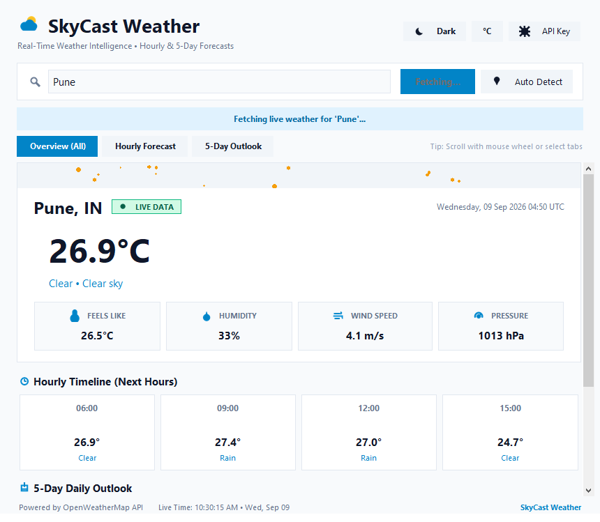
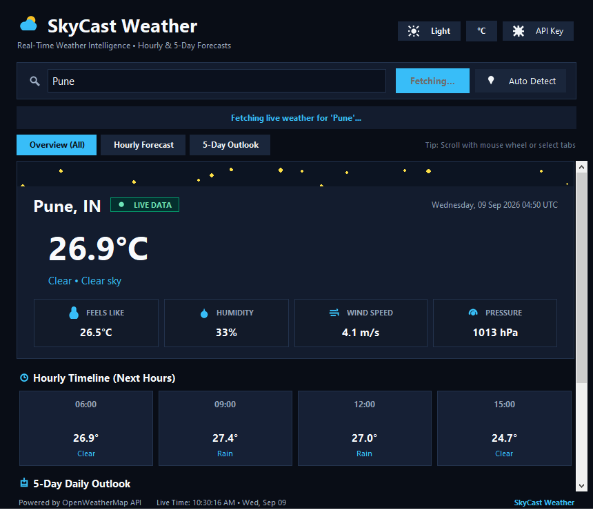

# SkyCast - Real-Time Weather Application

A Python Weather Application developed for Oasis Infobyte (OIBSIP) Task 4, providing both a Beginner Tier Command-Line Interface (CLI) and an Advanced Tier Graphical User Interface (GUI) built with Tkinter, Pillow, and the OpenWeatherMap API.

---

## Project Overview

SkyCast retrieves real-time meteorological observations and 5-day forecast data from OpenWeatherMap. The application provides two operating modes:
- A command-line interface supporting interactive querying and direct argument lookup.
- A desktop graphical user interface with responsive threading, metric displays, unit toggling, and local configuration persistence.

---

## Features

### Core Capabilities (Beginner Tier)
- **Location Lookup**: Interactive prompt supporting city names (e.g., Pune, Delhi, London) and postal / ZIP codes.
- **Direct CLI Argument**: Query weather immediately via command line: `python main.py --cli Pune`.
- **Comprehensive Weather Metrics**:
  - Temperature in Celsius (°C) and Fahrenheit (°F)
  - Perceived temperature ("Feels Like")
  - Humidity percentage (%)
  - Wind speed in meters per second (m/s) and miles per hour (mph)
  - Atmospheric pressure in hectopascals (hPa)
  - Weather condition category and detailed description
- **Input Validation**: Strips extra whitespace, validates query length, and reports invalid entries before dispatching network requests.
- **Error Handling**: Distinct handling for 404 (location not found), 401 (invalid/inactive key), 429 (rate limit), and network connectivity/timeout errors.

### Advanced Capabilities (GUI Tier)
- **Desktop Graphical Interface**: Custom Tkinter layout featuring dual themes (Dark Mode and Light Mode).
- **Unit Toggle (°C / °F)**: Instant unit conversion without re-requesting data from the network.
- **Hourly Forecast**: Displays weather forecasts for upcoming intervals with timestamps, conditions, and temperatures.
- **5-Day Daily Forecast**: Aggregates daily forecasts with minimum and maximum temperatures, condition descriptions, and weather icons.
- **Dynamic Weather Ambience**: Canvas-based particle animation reflecting current weather conditions (rain, snow, clouds, or clear sky).
- **Vector-Drawn UI Icons**: Anti-aliased graphical icons generated programmatically via Pillow (`icon_assets.py`), avoiding platform emoji dependency.
- **Weather Condition Icons**: Fetches and caches official OpenWeatherMap icon assets locally with vector fallback rendering.
- **Automatic Location Detection**: Optional IP-based geolocation lookup via `ipinfo.io` (with fallback to `ip-api.com`).
- **Non-Blocking Architecture**: Background daemon threads for network requests to prevent UI lockup.
- **In-App API Key Configuration**: Settings modal allowing users to enter, test, and save their OpenWeatherMap API key.
- **Demo Mode**: Built-in mock dataset allowing complete feature testing without an API key.

---

## Tech Stack

- **Language**: Python 3.8+
- **HTTP Client**: `requests`
- **Image Processing**: `Pillow` (PIL) for icon generation, caching, and downsampling
- **GUI Toolkit**: `tkinter` & `ttk` (Standard Python Library)
- **Testing Framework**: `unittest` with mock objects
- **APIs**:
  - [OpenWeatherMap API](https://openweathermap.org/api) (Current Weather & 5-Day / 3-Hour Forecast)
  - [ipinfo.io](https://ipinfo.io) (IP-based Geolocation fallback)

---

## Project Structure

```
Python Task4 WeatherApp/
├── weather_service.py       # API integration, data models, icon caching & geolocation
├── weather_gui.py           # Tkinter GUI implementation with dual themes & animations
├── weather_cli.py           # Command-line interface with interactive and argument modes
├── config.py                # Configuration loader and credential manager
├── icon_assets.py           # Procedural Pillow-based vector icon renderer
├── main.py                  # Application entry point (GUI default, --cli flag)
├── test_weather.py          # Automated unit test suite with mock API responses
├── requirements.txt         # External dependencies (requests, Pillow)
├── screenshots/             # Application preview captures (GUI Overview & Forecast Tabs)
├── .env.example             # Template for environment-based API key configuration
├── .gitignore               # Excludes secrets, cache, and virtual environments
└── README.md                # Project documentation and user guide
```

---

## Installation & Setup

### 1. Clone or Open the Workspace
Ensure you are inside the Task 4 project directory:
```bash
cd "Python Task4 WeatherApp"
```

### 2. Install Dependencies
Install the required packages using pip:
```bash
pip install -r requirements.txt
```

*(Note: `tkinter` is included by default with standard Python installations on Windows and macOS).*

---

## API Key Configuration

SkyCast uses the free tier of the OpenWeatherMap API.

1. Create a free account at [OpenWeatherMap](https://openweathermap.org/users/sign_up).
2. Generate an API key from your account dashboard.
3. Supply the key using one of three supported methods:

### Option A: Via GUI Settings (Recommended)
Launch the application (`python main.py`), click **API Key** in the header, paste your key, test it, and click **Save Key**. The key is stored locally in `config.json` (which is excluded from version control).

### Option B: Via Command Line
```bash
python weather_cli.py --set-key YOUR_API_KEY
```

### Option C: Via Environment Variable or `.env` File
Create a `.env` file in the project root based on `.env.example`:
```env
OPENWEATHER_API_KEY=your_32_character_api_key
```
Or set it in your environment:
```bash
# Windows PowerShell
$env:OPENWEATHER_API_KEY="your_32_character_api_key"

# Linux / macOS
export OPENWEATHER_API_KEY="your_32_character_api_key"
```

> **Note**: Newly registered OpenWeatherMap keys typically require 10 to 60 minutes after confirmation to activate on their servers. If no key is provided, the application runs in Demo Preview mode with simulated data.

---

## How to Run

### Graphical User Interface (Default)
```bash
python main.py
```
or directly:
```bash
python weather_gui.py
```

#### GUI Navigation:
- **Search Bar**: Enter a city name or ZIP code and press **Enter** or click **Get Weather**.
- **Auto Detect**: Click **Auto Detect** to determine your current city via your IP address.
- **Unit Switcher**: Toggle the **°C / °F** button to convert all temperatures dynamically.
- **Theme Toggle**: Switch between Dark and Light mode.
- **View Tabs**: Filter between Overview (All), Hourly Forecast, and 5-Day Outlook.

### Command-Line Interface (CLI Mode)

Run interactive CLI mode:
```bash
python main.py --cli
```
or:
```bash
python weather_cli.py
```

Query a location directly in one command:
```bash
python main.py --cli Pune
# or
python weather_cli.py "Bangalore"
```

#### Example CLI Output:
```text
==================================================
  WEATHER REPORT: PUNE, IN
==================================================
  Condition    : Clouds (scattered clouds)
  Temperature  : 28.3°C  |  82.9°F
  Feels Like   : 31.0°C  |  87.8°F
  Humidity     : 70%
  Wind Speed   : 3.6 m/s  (8.1 mph)
  Pressure     : 1008 hPa
  Report Time  : Monday, 08 Sep 2026 10:30 UTC
==================================================

  5-Day Outlook:
  --------------------------------------------
  Today    +0d      Clouds       24.0°C / 30.5°C  (75.2°F / 86.9°F)
  Tomorrow +1d      Rain         23.5°C / 29.0°C  (74.3°F / 84.2°F)
  Wed      +2d      Rain         23.0°C / 28.5°C  (73.4°F / 83.3°F)
  Thu      +3d      Clouds       24.0°C / 31.0°C  (75.2°F / 87.8°F)
  Fri      +4d      Clear        24.5°C / 32.0°C  (76.1°F / 89.6°F)
  --------------------------------------------
```

---

## Screenshots

### Light Mode Interface


### Dark Mode Interface


---

## Error Handling

The application contains explicit exception classes and recovery paths:
- **`ValidationError`**: Triggers when input is blank or fewer than 2 characters.
- **`CityNotFoundError`**: Triggers on HTTP 404 from the weather service; prompts user to verify spelling.
- **`InvalidApiKeyError`**: Triggers on HTTP 401; informs user about key requirements and activation delay.
- **`RateLimitError`**: Triggers on HTTP 429 when OpenWeatherMap rate thresholds are reached.
- **`NetworkError`**: Triggers on timeouts (configured at 8s) or connection drops.
- **In-GUI Banners**: Errors display as inline status notifications without crashing or throwing popup dialogs.

---

## Testing

A test suite covers unit conversion mathematics, input validation, JSON response parsing, and mocked network error states:

```bash
python -m unittest test_weather.py
```

Expected result:
```text
................
----------------------------------------------------------------------
Ran 16 tests in 0.010s

OK
```

---

## Future Improvements

- Historical weather trends and multi-day temperature graphs using `matplotlib`.
- Severe weather alerts and push notifications for registered locations.
- Multiple saved favorite cities with quick-access tabs in the GUI.
- Air Quality Index (AQI) integration using OpenWeatherMap's Air Pollution API.
