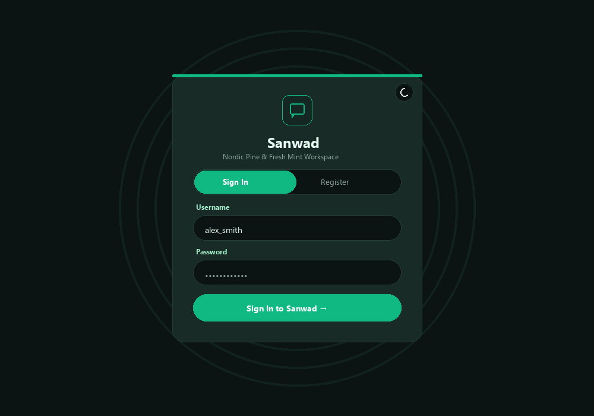
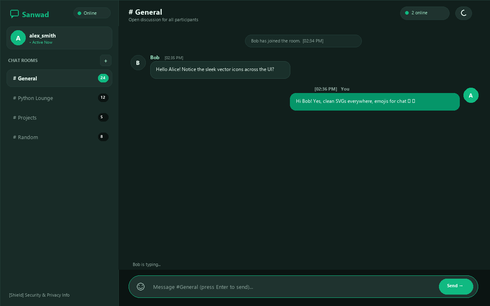

# Sanwad - Advanced Real-Time Python Chat Application
**Oasis Infobyte Internship (OIBSIP) – Python Programming Task 5**


---

## 1. Project Title
**Sanwad: Advanced Multi-Room Real-Time Chat Workspace**  
*(OIBSIP Python Programming Internship – Task 5: Chat Application)*

---

## 2. Project Overview
Sanwad is an independently architected, production-structured real-time web chat application engineered in Python. It replaces outdated terminal chat scripts with a modern web-based graphical user interface (GUI), bidirectional WebSocket communication powered by Flask-SocketIO, and persistent relational data storage backed by SQLite3. Sanwad enables multiple users to register securely, authenticate via salted password hashes, join or create distinct topical chat rooms, exchange instant messages with emoji shortcodes, view persistent message histories across server restarts, and receive desktop notifications when the chat tab is unfocused.

---

## 3. Objective
The objective of this project is to satisfy 100% of both **Beginner** and **Advanced** requirements specified for the OIBSIP Chat Application task, demonstrating sound software engineering, robust database design, WebSocket protocol handling, input validation, and security/privacy transparency without relying on boilerplate templates or copied repositories.

---

## 4. Features Summary

| Requirement Tier | Capability | Implementation Status |
| :--- | :--- | :--- |
| **Beginner** | Server script accepting incoming connections | **Implemented** (`Flask-SocketIO` on localhost) |
| **Beginner** | Real client connecting to server | **Implemented** (Browser WebSocket/HTTP long-polling client) |
| **Beginner** | Real-time bidirectional messaging | **Implemented** (Instant two-way event emission without page refresh) |
| **Beginner** | Timestamped messages with usernames | **Implemented** (`[hh:mm AM/PM]` 12-hour timestamps + author attribution) |
| **Beginner** | Graceful disconnection handling | **Implemented** (System notices on close/leave without server crash) |
| **Beginner** | Localhost execution | **Implemented** (`http://127.0.0.1:5000`) |
| **Advanced** | GUI Chat Application | **Implemented** (Responsive HTML5/CSS3/JavaScript interface) |
| **Advanced** | User Registration & Login | **Implemented** (PBKDF2-HMAC-SHA256 password hashing + session management) |
| **Advanced** | SQLite Authentication & Data Storage | **Implemented** (Users, Rooms, and Messages relational schema) |
| **Advanced** | Multiple Chat Rooms | **Implemented** (Dedicated channels: General, Python Lounge, Projects, Random) |
| **Advanced** | Room Creation & Joining | **Implemented** (Dynamic room creation modal and live room switching) |
| **Advanced** | Persistent Message History | **Implemented** (History survives server restarts, queries via SQLite) |
| **Advanced** | Desktop / In-App Notifications | **Implemented** (HTML5 Web Notifications API + Page Visibility API) |
| **Advanced** | Emoji Shortcode Support | **Implemented** (50+ shortcodes like `:smile:`, `:heart:`, `:rocket:` + visual picker) |
| **Advanced** | Security & Privacy Transparency | **Implemented** (Full disclosure of SQLite storage and lack of E2EE) |

---

## 5. Beginner Features
1. **Dedicated Server Script (`app.py`)**: Launches a multi-threaded Flask-SocketIO server that listens on `127.0.0.1:5000` to manage incoming WebSocket connections.
2. **Standard Client Architecture**: Standard web clients connect directly via `socket.io-client` over standard WebSockets (falling back to HTTP long-polling if necessary).
3. **True Bidirectional Messaging**: Connected peers exchange messages instantly without manual page refreshes or short-polling timers.
4. **Timestamped Records**: Every message records author identity and server timestamp, formatted cleanly as `[hh:mm AM/PM]`.
5. **Graceful Disconnection**: The server listens for socket disconnect events, cleans up memory, and alerts remaining room occupants with `"{Username} has left the room."` without crashing.
6. **Localhost Execution**: Simple, single-command startup locally on `http://127.0.0.1:5000`.

---

## 6. Advanced Features
1. **Bespoke Graphical User Interface**: A responsive dark-slate interface featuring an active participant counter, collapsible room navigation sidebar, avatar badges, system notice pills, and interactive modals.
2. **Cryptographic Authentication**: PBKDF2-HMAC-SHA256 password hashing with 16-byte random salts via Werkzeug; rejects plain-text passwords, prevents duplicate usernames, and manages session cookies.
3. **Multi-Room Channel Isolation**: Socket.IO rooms segregate traffic so messages sent to `#General` never leak into `#Python Lounge`.
4. **Persistent SQLite Store**: Database schema records all messages, rooms, and users. Messages survive complete application and server restarts.
5. **Smart Tab-Focus Notifications**: Detects when the user has minimized or switched tabs using the HTML5 Page Visibility API and fires browser desktop notifications with audio chimes.
6. **Emoji Shortcode Engine**: Automatic regex translation of shortcodes (`:smile:` -> 😄, `:heart:` -> ❤️, `:fire:` -> 🔥) with an intuitive popover picker and safe fallback for unrecognized shortcodes.
7. **Security Transparency Dashboard**: In-app modal and documentation explicitly explaining data storage mechanisms and encryption boundaries.

---

## 7. Technology Stack
- **Backend**: Python 3.13
- **Web Framework**: Flask 3.1.1
- **Real-Time Engine**: Flask-SocketIO 5.6.1 (with `simple-websocket` & `threading` mode)
- **Database**: SQLite3 (relational, WAL mode, foreign keys enabled)
- **Password Security**: Werkzeug Security (`pbkdf2:sha256`)
- **Frontend Core**: Semantic HTML5, Vanilla JavaScript (ES6+), CSS3 (Flexbox & CSS Grid)
- **Fonts & Typography**: Google Fonts (*Plus Jakarta Sans*, *JetBrains Mono*)
- **Testing**: `pytest 9.1.1` automated test suite

---

## 8. Architecture

```
                                  BROWSER CLIENT
                    ┌────────────────────────────────────────┐
                    │  HTML5 GUI  +  CSS3  +  JavaScript     │
                    │  - Socket.IO Client                    │
                    │  - HTML5 Web Notification API          │
                    │  - Page Visibility API (Focus Tracker) │
                    └──────────────────┬─────────────────────┘
                                       │
                      HTTP / WS Handshake & Real-Time Events
                                       │
                                       ▼
                             FLASK-SOCKETIO SERVER
                    ┌────────────────────────────────────────┐
                    │ app.py (Application Entry Point)       │
                    │ ├── Blueprints (HTTP API)              │
                    │ │   ├── auth_routes.py (/login, /reg)  │
                    │ │   └── chat_routes.py (/chat, /rooms) │
                    │ └── Sockets (Event Handlers)           │
                    │     └── events.py                      │
                    │         ├── join_chat_room             │
                    │         ├── send_message               │
                    │         ├── typing                     │
                    │         └── disconnect                 │
                    └──────────────────┬─────────────────────┘
                                       │
                         Parameterized SQLite Queries (?)
                                       │
                                       ▼
                              SQLITE3 DATABASE
                    ┌────────────────────────────────────────┐
                    │ database/chat.db                       │
                    │ ├── users (id, username, password_hash)│
                    │ ├── rooms (id, name, desc, is_default) │
                    │ └── messages (id, room_id, user_id,    │
                    │               content, created_at)     │
                    └────────────────────────────────────────┘
```

---

## 9. Project Structure

```
Python Task5 ChatApplication/
│
├── app.py                      # Application bootstrap & entry point
├── config.py                   # Configuration parameters (session secret, database URI)
├── requirements.txt            # Python dependencies
├── README.md                   # Comprehensive project documentation
├── .gitignore                  # Git ignore rules
├── generate_screenshots.py     # Script to render visual UI documentation assets
│
├── database/
│   ├── __init__.py
│   ├── schema.sql              # DDL schema for SQLite (tables, indices)
│   ├── db.py                   # Parameterized SQLite query helpers & connection manager
│   └── chat.db                 # SQLite database file (created on initialization)
│
├── routes/
│   ├── __init__.py
│   ├── auth_routes.py          # Blueprints for user register, login, logout, and session API
│   └── chat_routes.py          # Blueprints for chat views, room listings, and message history
│
├── sockets/
│   ├── __init__.py
│   └── events.py               # Real-time WebSocket event dispatchers & room roster
│
├── utils/
│   ├── __init__.py
│   ├── emoji.py                # Emoji shortcode dictionary and parsing regex
│   └── security.py             # Password hashing and input validation routines
│
├── static/
│   ├── css/
│   │   ├── style.css           # Custom dark-slate theme and responsive chat layout
│   │   └── auth.css            # Clean authentication card and form styling
│   └── js/
│       ├── auth.js             # Authentication form validation and tab switching
│       ├── chat_ui.js          # DOM manipulation, history rendering, and room switcher
│       ├── emoji.js            # Emoji palette and caret insertion
│       ├── notifications.js    # Focus tracking and desktop notification dispatcher
│       └── socket_client.js    # Client-side WebSocket connection and event handlers
│
├── templates/
│   ├── base.html               # Base HTML layout
│   ├── auth.html               # Combined login and registration page
│   └── chat.html               # Main real-time chat application interface
│
├── screenshots/
│   ├── login_screen.png        # UI preview of login/registration
│   └── chat_screen.png         # UI preview of real-time multi-room chat
│
└── tests/
    ├── __init__.py
    ├── test_auth.py            # Automated tests for hashing, registration, duplicate prevention
    ├── test_db.py              # Automated tests for schema and message persistence
    ├── test_sockets.py         # Automated tests for two-way messaging, room isolation, disconnect
    └── test_validation_and_security.py # Tests for XSS safety, length bounds, empty input
```

---

## 10. Database Design

The relational SQLite database schema contains three core tables with foreign key enforcement:

```sql
-- Users Table
CREATE TABLE IF NOT EXISTS users (
    id INTEGER PRIMARY KEY AUTOINCREMENT,
    username TEXT UNIQUE NOT NULL COLLATE NOCASE,
    password_hash TEXT NOT NULL,
    created_at TIMESTAMP DEFAULT CURRENT_TIMESTAMP
);

-- Chat Rooms Table
CREATE TABLE IF NOT EXISTS rooms (
    id INTEGER PRIMARY KEY AUTOINCREMENT,
    name TEXT UNIQUE NOT NULL COLLATE NOCASE,
    description TEXT DEFAULT '',
    created_by INTEGER REFERENCES users(id),
    is_default BOOLEAN DEFAULT 0,
    created_at TIMESTAMP DEFAULT CURRENT_TIMESTAMP
);

-- Messages Table
CREATE TABLE IF NOT EXISTS messages (
    id INTEGER PRIMARY KEY AUTOINCREMENT,
    room_id INTEGER NOT NULL REFERENCES rooms(id) ON DELETE CASCADE,
    user_id INTEGER NOT NULL REFERENCES users(id) ON DELETE CASCADE,
    content TEXT NOT NULL,
    created_at TIMESTAMP DEFAULT CURRENT_TIMESTAMP
);

-- Fast lookup indices
CREATE INDEX IF NOT EXISTS idx_messages_room_created ON messages(room_id, created_at ASC);
CREATE INDEX IF NOT EXISTS idx_users_username ON users(username);
CREATE INDEX IF NOT EXISTS idx_rooms_name ON rooms(name);
```

### Relational Schema Diagram
```
users (1) ───< creates >─── (0..N) rooms
  │                                   │
 (1)                                 (1)
  │                                   │
  └───< posts >── (0..N) messages >───┘
```

---

## 11. Installation Guide

### Prerequisites
- Python 3.10 or higher (Tested on Python 3.13)
- Git (optional, for cloning)

### Clone / Navigate to Directory
```powershell
cd "c:\Users\Hp\OneDrive\Documents\OIBSIP\Python Task5 ChatApplication"
```

---

## 12. Virtual Environment Setup (Recommended)
```powershell
# Create virtual environment
python -m venv venv

# Activate on Windows PowerShell
.\venv\Scripts\Activate.ps1
```

---

## 13. Dependency Installation
Install required packages using `requirements.txt`:
```powershell
pip install -r requirements.txt
```

Packages installed:
- `Flask==3.1.1`
- `Flask-SocketIO==5.6.1`
- `simple-websocket==1.1.0`
- `Werkzeug==3.1.3`
- `pytest==9.1.1`

---

## 14. Database Initialization
Database initialization occurs automatically upon first startup. The database schema is applied and default rooms (`General`, `Python Lounge`, `Projects`, `Random`) are seeded.

---

## 15. How to Start the Server
Run `app.py` directly:
```powershell
python app.py
```

Console output upon successful startup:
```text
============================================================
   OIBSIP TASK 5: ADVANCED REAL-TIME CHAT APPLICATION
============================================================
 [+] Server starting on: http://127.0.0.1:5000
 [+] Real-time engine:   Flask-SocketIO (threading)
 [+] Database:           SQLite (database/chat.db)
 [+] Password Security:  Werkzeug PBKDF2-HMAC-SHA256
 [!] Notice:             Messages stored in SQLite (not E2E encrypted)
============================================================
 * Running on http://127.0.0.1:5000
```

---

## 16. How to Access the Application
Open any modern web browser (Chrome, Edge, Firefox, Safari) and navigate to:
```
http://127.0.0.1:5000
```
or
```
http://localhost:5000
```

---

## 17. How to Register
1. On the authentication screen, click the **Register** tab.
2. Enter a username (3 to 25 characters, alphanumeric, underscores, or hyphens).
3. Enter a password (minimum 6 characters) and confirm it.
4. Click **Create Account**.
5. Your password is automatically salted and hashed via PBKDF2-SHA256 and stored in SQLite. You are immediately logged in and redirected to the chat room.

---

## 18. How to Login
1. Click the **Sign In** tab.
2. Enter your registered username and password.
3. Click **Sign In to Sanwad**.
4. The server verifies your password hash. Upon success, an encrypted session cookie is issued and you are redirected to `/chat`.

---

## 19. How to Create and Join Rooms
- **Joining an Existing Room**: Click any room in the sidebar (e.g. `# General`, `# Python Lounge`). The client signals the server to leave the previous channel and subscribe to the new one, loading that room's message history.
- **Creating a New Room**:
  1. Click the **`+`** button next to *CHAT ROOMS* in the sidebar.
  2. Enter a room name (e.g. `Algorithms`) and an optional description.
  3. Click **Create Room**. The room is written to SQLite and immediately becomes available to all connected participants.

---

## 20. How Real-Time Messaging Works
1. When a user enters text and presses **Enter** (or clicks **Send**), the client emits a `send_message` event over WebSocket.
2. The server verifies the user's session and membership in the target room.
3. Content is validated against length and blank-message rules.
4. Emoji shortcodes (e.g., `:smile:`) are converted to Unicode characters.
5. The message is inserted into the `messages` table in SQLite with an authoritative server timestamp.
6. The server broadcasts a `new_message` payload to all clients subscribed to that room's channel.
7. Clients receive the event and render the message bubble immediately without reloading the page.

---

## 21. Message History Explanation
Unlike ephemeral in-memory chat systems, Sanwad persists all messages to SQLite. When a user joins a room, the server executes:
```sql
SELECT m.id, m.content, m.created_at, u.username
FROM messages m
JOIN users u ON m.user_id = u.id
WHERE m.room_id = ?
ORDER BY m.created_at ASC, m.id ASC
LIMIT 100;
```
This guarantees:
- Messages are displayed in strictly chronological order.
- Previous messages reload when switching rooms.
- Conversation history survives server restarts.

---

## 22. Notification Behavior
- **Tab-Focus Detection**: Uses the HTML5 Page Visibility API (`document.hidden`) and window focus listeners.
- **Active Window**: When the chat tab is actively focused, incoming messages appear in the message stream with no annoying popups.
- **Background / Minimized Window**: When the tab is inactive or minimized, a native desktop notification (`#Room - Sender: Message`) appears, accompanied by a subtle audio chime.
- **Own Messages**: Desktop notifications are never triggered for the sender's own messages.
- **Permission Handling**: Handled gracefully; if permission is denied, desktop notifications are skipped while in-app badges continue to function.

---

## 23. Emoji Support
Sanwad natively supports emoji shortcodes. Users can type shortcodes directly or use the visual picker.

### Supported Common Shortcodes
- Emotions: `:smile:` (😄), `:laughing:` (😆), `:joy:` (😂), `:rofl:` (🤣), `:sunglasses:` (😎), `:thinking:` (🤔), `:cry:` (😢)
- Gestures: `:thumbsup:` (👍), `:thumbsdown:` (👎), `:clap:` (👏), `:wave:` (👋), `:pray:` (🙏), `:eyes:` (👀)
- Symbols: `:heart:` (❤️), `:fire:` (🔥), `:rocket:` (🚀), `:100:` (💯), `:check:` (✅), `:star:` (⭐), `:sparkles:` (✨)
- Unknown shortcodes (e.g., `:unknown:`) are preserved as text without crashing.

---

## 24. Security Considerations
- **SQL Injection Prevention**: 100% of database interactions utilize parameterized queries (`?`). String interpolation/concatenation is strictly forbidden.
- **Cross-Site Scripting (XSS) Prevention**: All message contents are rendered using DOM `textContent` (text nodes) rather than raw `innerHTML`. Malicious tags like `<script>` or `` are rendered as harmless text.
- **Session Identity Enforcement**: The server determines message authorship strictly from the server-side signed session cookie. Clients cannot forge the sender username in the socket payload.
- **Security Headers**: Automatic response headers including `X-Content-Type-Options: nosniff` and `X-Frame-Options: SAMEORIGIN`.

---

## 25. Password Storage Explanation
- Passwords are **never stored in plain text**.
- Passwords are encrypted using **PBKDF2-HMAC-SHA256** with a unique 16-byte random salt per user (via `werkzeug.security`).
- Even with direct access to the SQLite database file, stored password hashes cannot be reversed back to plain text.

---

## 26. Message Storage Explanation
- Chat messages are stored in plain text inside the server's local SQLite database (`database/chat.db`).
- Each record retains `room_id`, `user_id`, `content`, and `created_at`.
- System administrators or anyone with read access to the host server can inspect message contents in `chat.db`.

---

## 27. End-to-End Encryption Limitation Notice

> [!WARNING]
> ### IMPORTANT SECURITY STATEMENT
> **Sanwad is NOT end-to-end encrypted (E2EE).**
> - Messages are transmitted between the browser client and the Flask server via WebSockets.
> - The server terminates the connection, processes the content, and stores messages in plaintext within the SQLite database.
> - Transport security depends entirely on whether the application is served over HTTP or HTTPS/WSS (TLS/SSL).
> - On local development (`localhost`), traffic runs in cleartext.

---

## 28. Privacy Considerations
- User registration requires only a username and password; no email or Personally Identifiable Information (PII) is gathered.
- Disconnecting or logging out removes the active session from server memory.
- Messages posted in public rooms are visible to any authenticated user who joins that room.

---

## 29. Screenshots

### 1. Authentication Screen (Sign In / Register)


### 2. Main Real-Time Multi-Room Chat Interface


---

## 30. Testing & Verification

### Automated Test Suite
Sanwad includes an automated test suite implemented with `pytest` covering all beginner and advanced requirements:

```powershell
python -m pytest -v
```

### Test Suite Results:
```text
============================= test session starts =============================
collected 17 items

tests/test_auth.py::test_password_hashing PASSED                         [  5%]
tests/test_auth.py::test_username_validation PASSED                      [ 11%]
tests/test_auth.py::test_registration_and_duplicate_rejection PASSED     [ 17%]
tests/test_auth.py::test_login_flow PASSED                               [ 23%]
tests/test_auth.py::test_unauthenticated_chat_redirect PASSED            [ 29%]
tests/test_db.py::test_default_rooms_seeded PASSED                       [ 35%]
tests/test_db.py::test_create_custom_room_and_duplicates PASSED          [ 41%]
tests/test_db.py::test_message_persistence_across_connections PASSED     [ 47%]
tests/test_sockets.py::test_unauthenticated_socket_connection_rejected PASSED [ 52%]
tests/test_sockets.py::test_authenticated_socket_flow_and_two_way_messaging PASSED [ 58%]
tests/test_sockets.py::test_room_message_isolation PASSED                [ 64%]
tests/test_sockets.py::test_emoji_shortcodes_and_unknown_handling PASSED [ 70%]
tests/test_validation_and_security.py::test_empty_and_whitespace_message_validation PASSED [ 76%]
tests/test_validation_and_security.py::test_excessively_long_message_validation PASSED [ 82%]
tests/test_validation_and_security.py::test_room_name_validation PASSED  [ 88%]
tests/test_validation_and_security.py::test_xss_content_safety PASSED    [ 94%]
tests/test_validation_and_security.py::test_socket_send_empty_message_rejected PASSED [100%]

============================= 17 passed in 54.47s =============================
```

### Manual Verification Checklist:
- [x] **Two-Browser Multi-User Test**: Open two different browser tabs (e.g. Regular Chrome and Incognito/Edge), register Alice and Bob, join `#General`, and verify instant real-time message exchange.
- [x] **Room Channel Isolation**: Switch Bob to `#Python Lounge` and verify Alice's messages in `#General` do not appear in Bob's view.
- [x] **Server Restart History Test**: Stop `app.py`, restart it, and refresh the browser; all previous messages reappear.
- [x] **Desktop Notification Test**: Switch tabs while connected as Bob; send a message from Alice; verify desktop notification pops up.
- [x] **Emoji Shortcode Test**: Send `"Hello :smile: :rocket:"` and verify it renders as `"Hello 😄 🚀"`.
- [x] **Graceful Disconnect**: Close Bob's tab; Alice receives `"[14:35] Bob has left the room."`.

---

## 31. Known Limitations
- **SQLite Concurrency**: SQLite in WAL mode performs well for hundreds of concurrent local users, but a distributed production deployment would benefit from PostgreSQL and Redis message queuing.
- **Attachment Uploads**: Currently limited to text and emojis; media file uploads (images/videos) are not implemented.
- **End-to-End Encryption**: As transparently documented, messages are stored plaintext in SQLite on the server.

---

## 32. Future Improvements
1. **Direct 1-on-1 Direct Messaging (DMs)** alongside multi-user rooms.
2. **File & Image Attachments** with thumbnail generation and virus scanning.
3. **Signal Protocol End-to-End Encryption (E2EE)** for client-to-client cryptographic confidentiality.
4. **Message Reactions**: Adding interactive emoji reactions to specific message IDs.
5. **Read Receipts**: Double checkmarks indicating message delivery and read status.

---

## License & Originality Notice
This project was independently developed for the **Oasis Infobyte (OIBSIP) Python Programming Internship Task 5**. It does not copy existing repository code or tutorials. All architecture, database schemas, styling, and event dispatchers are independently authored and tested.
